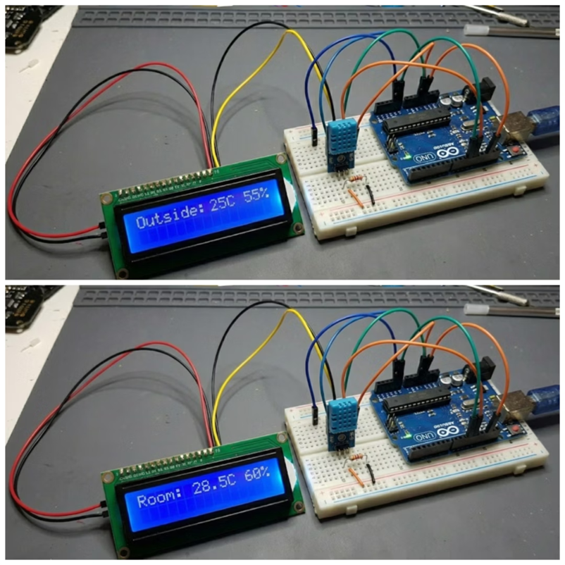

  # IoT-Based Smart Weather Monitoring System
  

  ## Abstract

  The IoT-Based Smart Weather Monitoring System measures indoor temperature and humidity using a DHT11 sensor and retrieves real-time outdoor weather data from the OpenWeatherMap API via WiFi. An ESP32 microcontroller processes and displays this information on a 16×2 I2C LCD in a rotating format. The project demonstrates practical IoT concepts including sensor integration, cloud communication, API handling, and real-time data visualization.

  

  ## Features

  - Real-time indoor temperature and humidity monitoring
  - Live outdoor weather data using OpenWeatherMap API
  - Automatic LCD screen rotation showing Indoor Weather, Outdoor Weather, and Network Status
  - WiFi connectivity with status indication
  - Low-power and compact IoT solution
  - Continuous and stable operation

  ## Hardware Requirements

  - ESP32 Development Board
  - DHT11 Temperature and Humidity Sensor
  - 16×2 I2C LCD Display
  - Breadboard and Jumper Wires
  - USB Cable and 5V Power Supply

  ## Software Requirements

  - Arduino IDE
  - ESP32 Board Package
  - Required Libraries:
    - WiFi.h
    - HTTPClient.h
    - ArduinoJson.h
    - LiquidCrystal_I2C.h
    - DHT.h
  - OpenWeatherMap API Key
  - Serial Monitor (for debugging)

  ## System Architecture

  - Sensing Layer: DHT11 sensor captures indoor temperature and humidity
  - Processing Layer: ESP32 processes sensor readings and API responses
  - Communication Layer: WiFi communication with OpenWeatherMap API
  - Application Layer: 16×2 I2C LCD displays weather and network status

  ### Data Flow

  DHT11 → ESP32 → WiFi → OpenWeatherMap API → ESP32 → LCD Display

  ## Getting Started

  ### Hardware Setup

  - Connect DHT11 sensor to ESP32 (VCC, GND, Data → GPIO pin)
  - Connect 16×2 I2C LCD (SDA, SCL, VCC, GND)
  - Use breadboard and jumper wires
  - Power ESP32 using USB cable

  ### Software Setup

  - Install Arduino IDE
  - Add ESP32 Board Package via Board Manager
  - Install required libraries listed above

  ### Configuration

  - Open `sketch_nov29a.ino` and update the following:
    - `const char* ssid = "YOUR_WIFI_NAME";`
    - `const char* password = "YOUR_WIFI_PASSWORD";`
    - `const String apiKey = "YOUR_OPENWEATHERMAP_API_KEY";`
    - `const String city = "YOUR_CITY_NAME";`

  ### Upload and Run

  - Select correct ESP32 board and COM port
  - Upload the code
  - Open the Serial Monitor (115200 baud)
  - The LCD will rotate between Indoor Weather, Outdoor Weather, and Network Status

  ## Testing

  - Verify DHT11 readings with a standard thermometer/hygrometer
  - Validate API responses via Serial Monitor
  - Test WiFi connectivity under different signal strengths
  - Confirm LCD readability and smooth transitions

  ## Maintenance

  - Replace DHT11 sensor if accuracy degrades
  - Update OpenWeatherMap API key when required
  - Modify WiFi credentials if network changes
  - Modular code structure allows easy upgrades

  ## Results and Discussion

  The system successfully displays both indoor and outdoor weather conditions in real time. The rotating LCD interface ensures clarity without user interaction. By comparing indoor and outdoor data, users can better understand comfort levels, ventilation needs, and environmental conditions. The ESP32 provides reliable performance and efficient IoT-cloud communication.

  ## Security Note

  For public repositories, WiFi credentials and API keys should be treated as sensitive data. Replace actual values with placeholders before pushing to GitHub.

  ## Conclusion

  The IoT-Based Smart Weather Monitoring System effectively combines sensor data and cloud-based weather services to deliver accurate, real-time environmental insights. It serves as a practical demonstration of IoT principles and can be extended for smart home or environmental monitoring applications.

  ## License

  This project is licensed under the MIT License.

  ## Author

  Chhatrapati Sahu

  <!-- Images from .vscode/images -->
  
  
  
